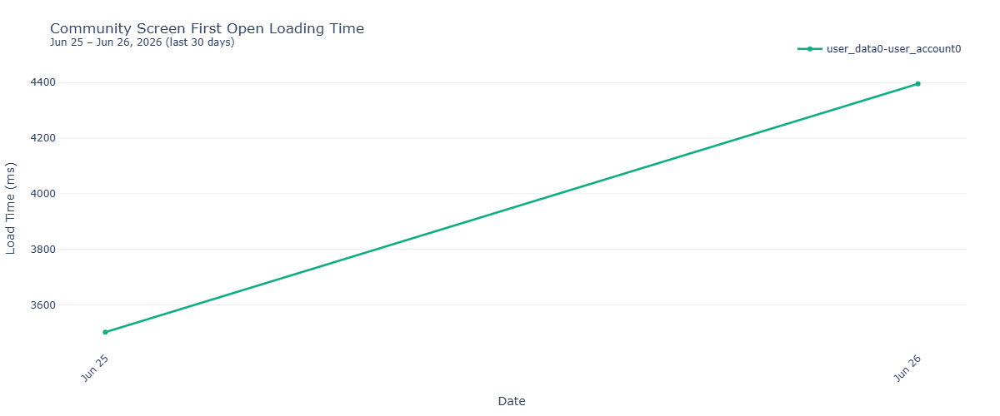
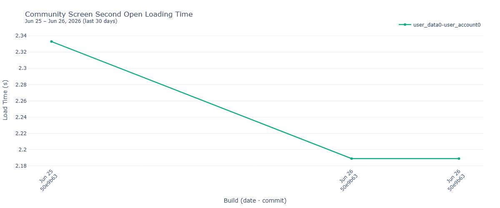

# Benchmark Results
Automated test suite performance tracking for Windows platform.

## Adding new tests
<details>
<summary><b>How to add a new performance test</b></summary>

1. Edit [`./scripts/tests_config.toml`](./scripts/tests_config.toml) and add:

```toml
[[tests]]
test_id = "test_my_feature"
display_name = "My Feature Loading Time Performance"
graph_filename = "my_feature_loading_time.png"
pattern = "test_my_feature"
ylabel = "Load Time (ms)"
```

2. Merge the change. Jenkins will pick up the new test on the next scheduled run — it generates PNG charts in `docs/` and updates the **Performance Tests** section in this README automatically.


</details>

## Summary Metrics

*All charts show data from the last 30 days.*

<details>
<summary><b>Total Test Suite Duration</b></summary>


</details>

---

## Performance Tests

<!-- performance-tests:start -->

<details>
<summary><b>Wallet Screen Loading Time Performance</b></summary>


</details>

<details>
<summary><b>Swap Screen Loading Time Performance</b></summary>


</details>

<details>
<summary><b>Community Screen First Open Loading Time</b></summary>


</details>

<details>
<summary><b>Community Screen Second Open Loading Time</b></summary>


</details>

<details>
<summary><b>Wallet Assets Screen Loading Time Performance</b></summary>


</details>
<!-- performance-tests:end -->

---
