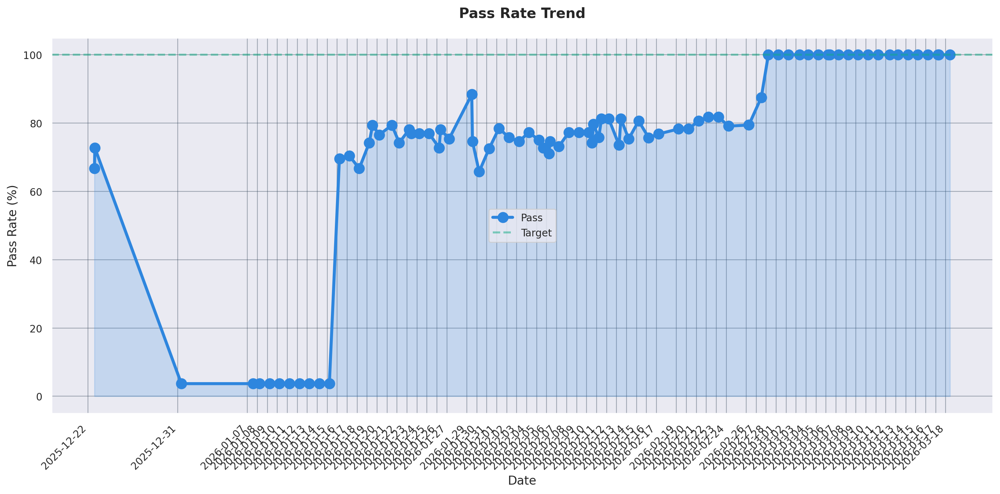
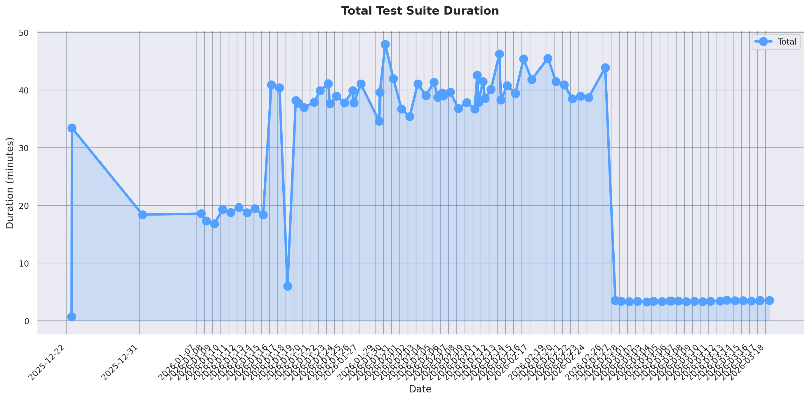
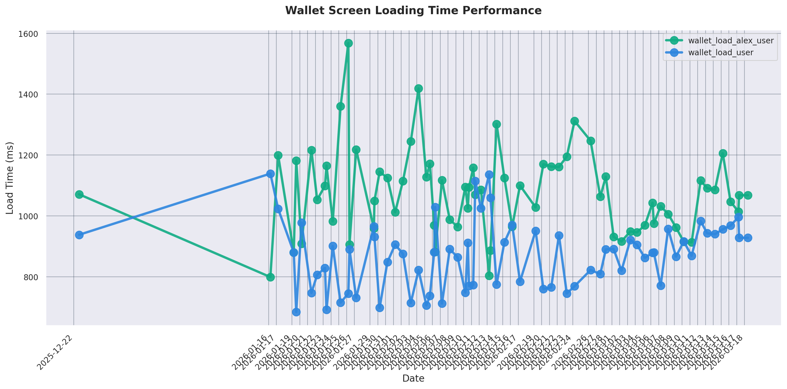
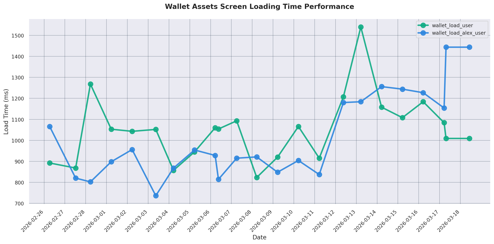
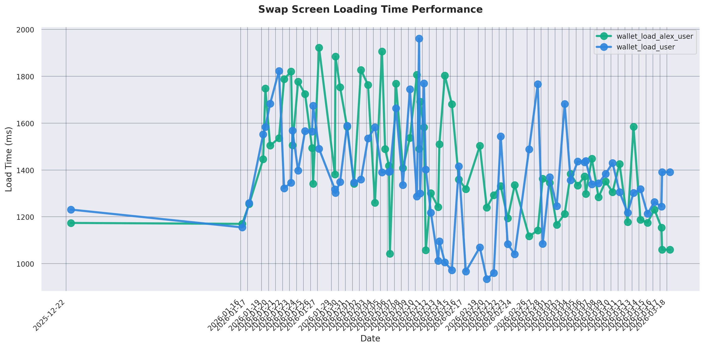
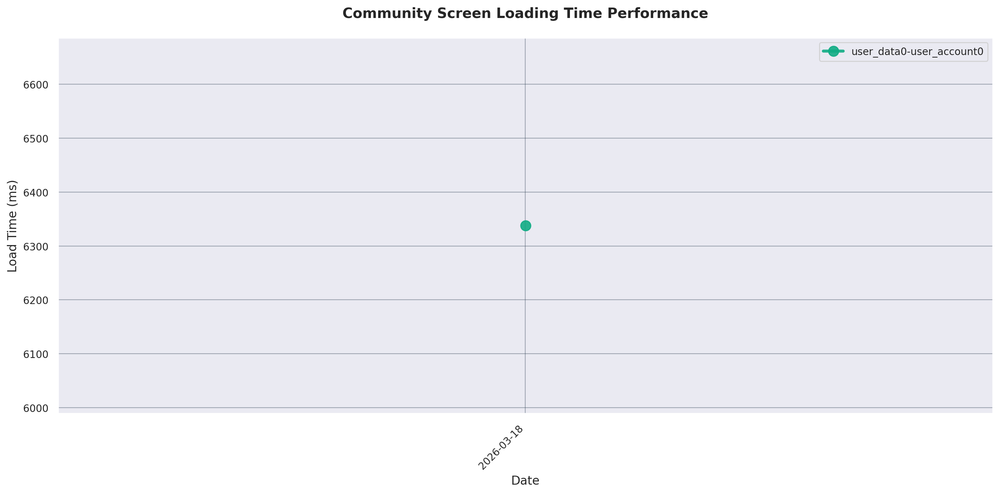

# Benchmark Results
Automated test suite performance tracking for Windows platform.

## Adding new tests
<details>

1. Edit `./scripts/benchmark_config.toml` and add:

```toml
[[tests]]
test_id = "test_my_feature"
display_name = "My Feature Loading Time"
graph_filename = "my_feature_loading_time.png"
pattern = "test_my_feature"
ylabel = "Load Time (ms)"
```

2. Add your test in this README.md under section `Performance tests`:
```markdown
<summary><b>My Feature Loading Time</b></summary>


```
</details>


## Summary Metrics

<summary><b>Pass Rate Trend</b></summary>



<summary><b>Total Test Suite Duration</b></summary>



---

## Performance Tests

<summary><b>Wallet Screen Loading Time Performance</b></summary>



<summary><b>Wallet Assets Loading Time Performance</b></summary>



<summary><b>Swap Screen Loading Time Performance</b></summary>



<summary><b>Community Screen Loading Time Performance</b></summary>



---
