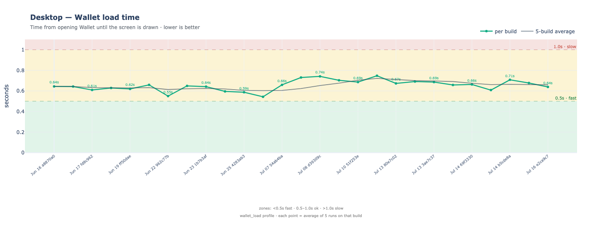
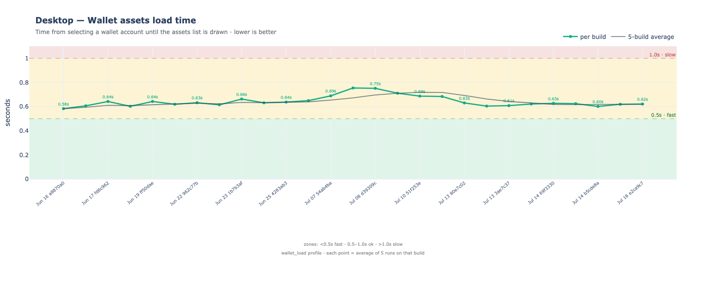
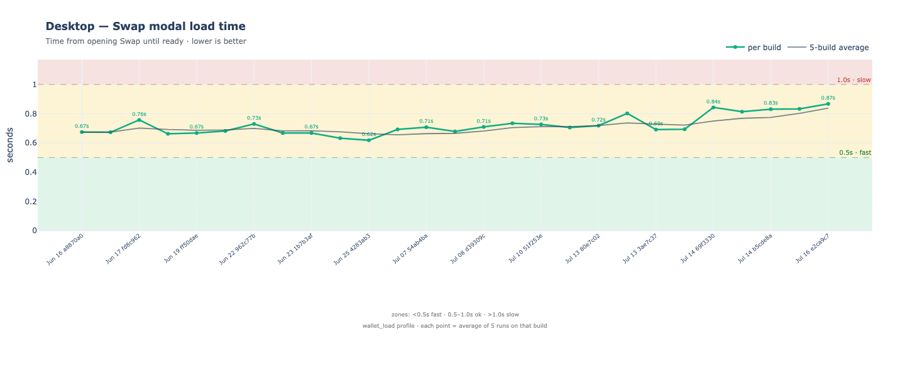
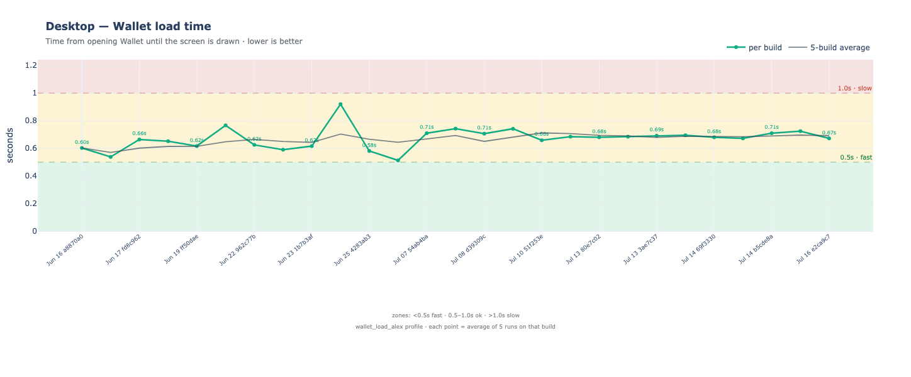
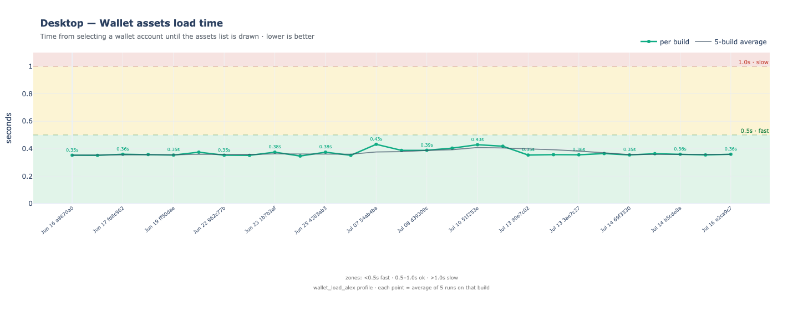
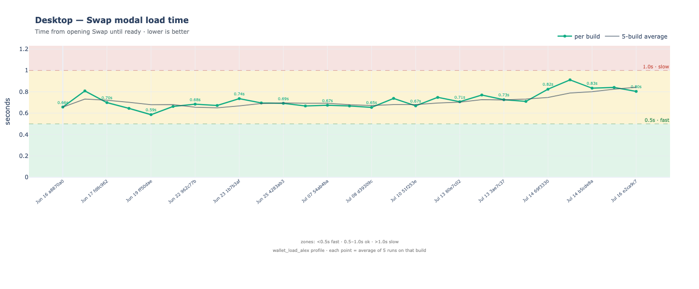

# Windows — performance benchmarks

Automated test suite performance tracking for the Windows desktop app.
Charts show data from the last 30 days — each point is one nightly run.
Load-time charts plot the average of runs per build. Lower is better.

> **Viewing charts:** This README renders inline PNG images on GitHub — works without
> GitHub Pages. For interactive charts (hover tooltips, zoom), use the
> [interactive dashboard](https://status-im.github.io/status-app-benchmarks/desktop/) once GitHub Pages is enabled.

Full CSV history: [`data/`](../../data/).

## System info

**Host:** WINDOWS-NODE-01 · **Windows:** Windows Server 2022 Standard 21H2 · **OS build:** 20348.1487 · **CPU:** AMD Ryzen 7 PRO 8700GE w/ Radeon 780M Graphics · **RAM:** 63 GB

## Wallet — Fresh account

Load times for a newly onboarded account (no pre-seeded user data).

_No data yet — charts will appear after the next nightly benchmark run._

## Wallet — wallet_load profile

Returning user with wallet_load profile (~29 MB user data).

## Wallet — wallet_load_alex profile

Returning user with wallet_load_alex profile (~16 MB user data).

## Community — status_community_member profile

Returning user with Status community already joined.

---

Generated by `scripts/benchmark.py graphs` from `data/`. Refreshed nightly by Jenkins.
