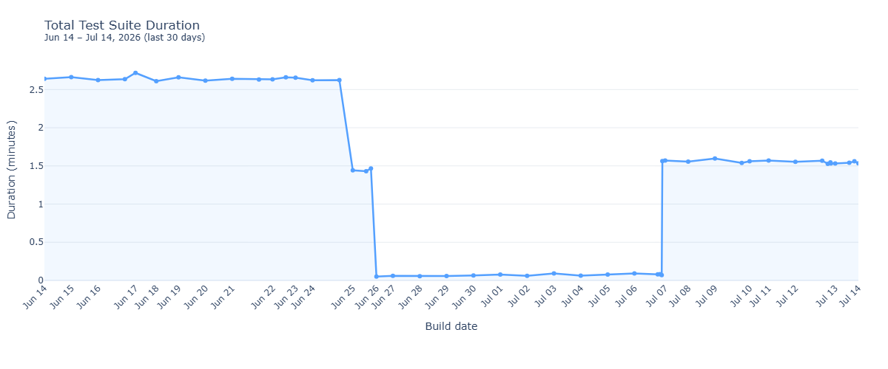
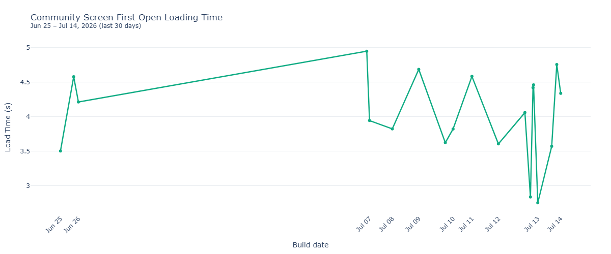
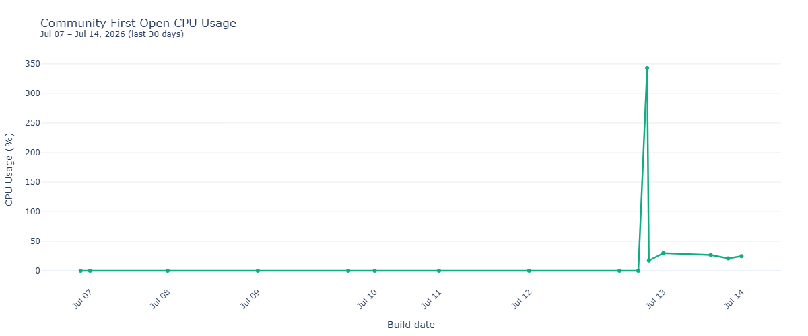
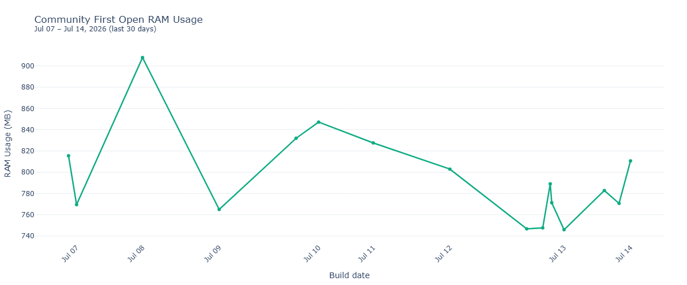
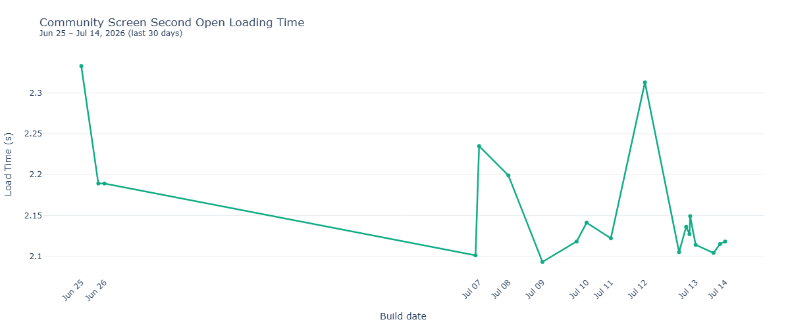
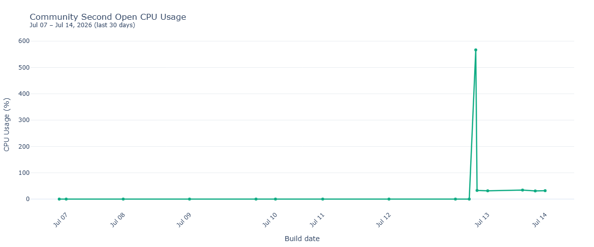
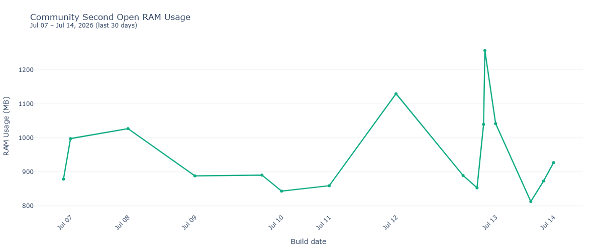
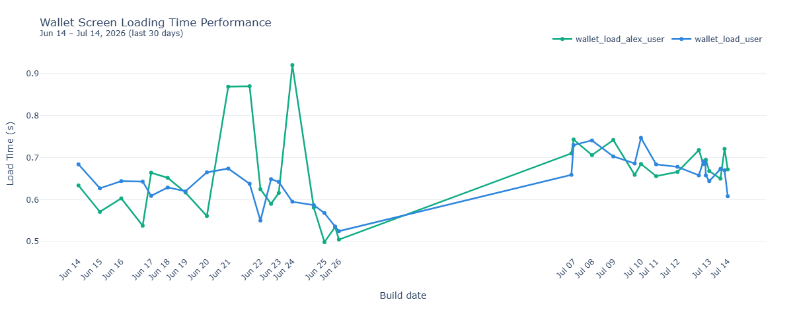
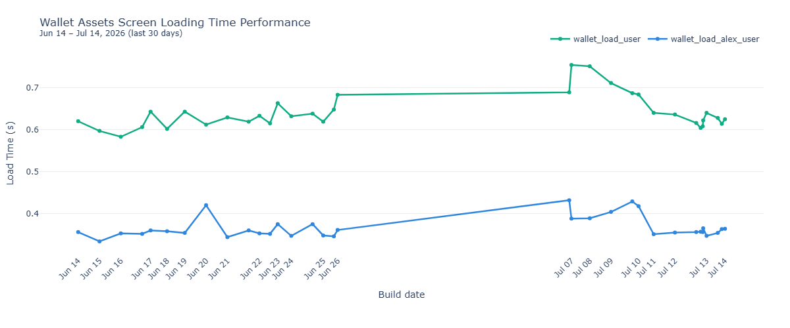
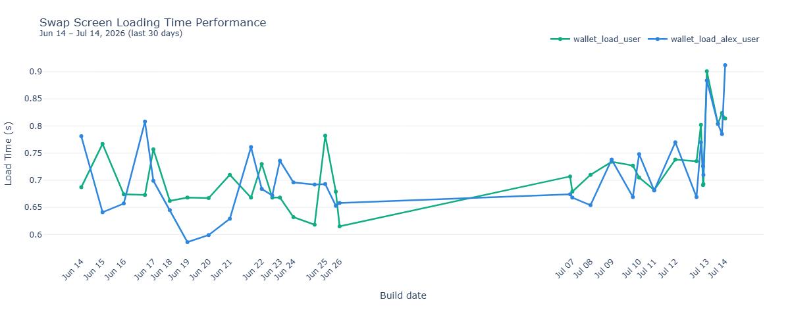

# Windows — performance benchmarks

Automated test suite performance tracking for the Windows desktop app.
Charts show data from the last 30 days — each point is one nightly run.
Load-time charts plot the average of runs per build. Lower is better.

> **Viewing charts:** This README renders inline PNG images on GitHub — works without
> GitHub Pages. For interactive charts (hover tooltips, zoom), use the
> [interactive dashboard](https://status-im.github.io/status-app-benchmarks/desktop/) once GitHub Pages is enabled.

Full CSV history: [`data/`](../../data/).

## Summary

## System info

**Host:** WINDOWS-NODE-01 · **Windows:** Windows Server 2022 Standard 21H2 · **OS build:** 20348.1487 · **CPU:** AMD Ryzen 7 PRO 8700GE w/ Radeon 780M Graphics · **RAM:** 63 GB

## Community — First Open

Load time, CPU, and RAM when opening the Status community for the first time after login.

> Each point = average of runs on that build.

## Community — Second Open

Warm open: navigate to portal then re-open. Load time averaged over 5 runs; CPU and RAM per open.

> Each point = average of runs on that build.

## Wallet

Wallet screen load time and per-account assets list load time.

> Each point = average of runs on that build.

> Each point = average of runs on that build.

## Swap

Swap modal load time.

> Each point = average of runs on that build.

---

Generated by `scripts/benchmark.py graphs` from `data/`. Refreshed nightly by Jenkins.
